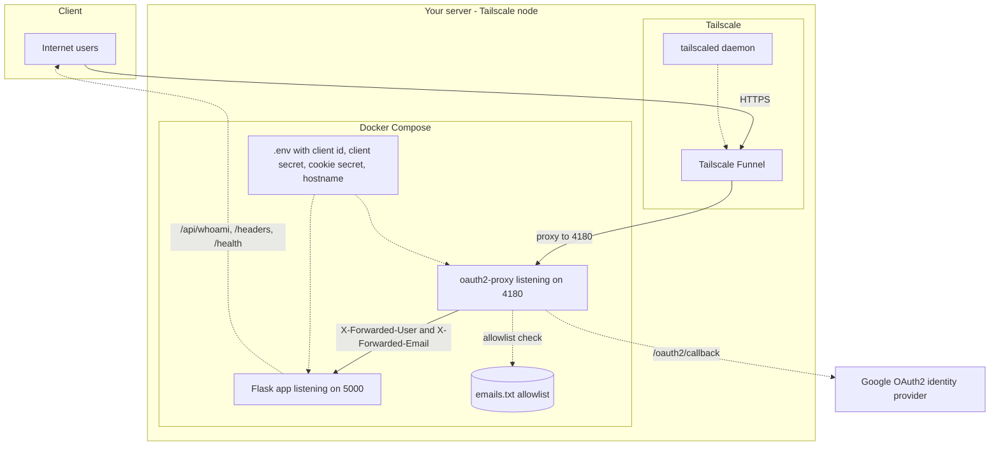
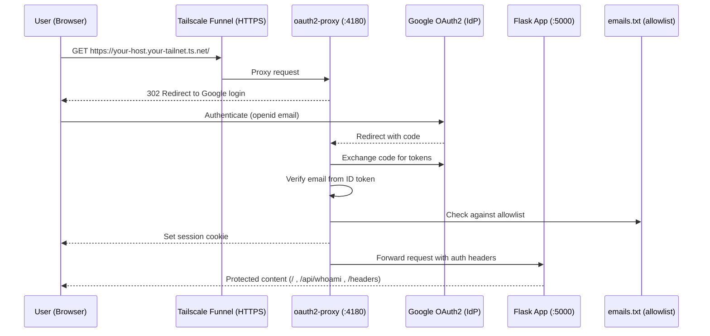

<a id="readme-top"></a>

# Shark-no-Ninsho-Mon

> **Secure Public Web Apps with Google OAuth via Tailscale Funnel**

[](https://www.docker.com/)
[](https://tailscale.com/)
[](https://developers.google.com/identity/protocols/oauth2)
[](https://flask.palletsprojects.com/)


A **production-ready**, **zero-configuration** solution for exposing self-hosted web applications to the internet with enterprise-grade Google authentication. Built with Tailscale Funnel, OAuth2 Proxy, and Docker for maximum security and minimal setup complexity.

## Table of Contents

- [Features](#features)
- [Quick Start](#quick-start)
- [Architecture](#architecture)
- [Prerequisites](#prerequisites)
- [Configuration](#configuration)
- [Environment Configuration](#environment-configuration)
- [Deployment](#deployment)
- [Testing & Verification](#testing--verification)
- [Stopping & Cleanup](#stopping--cleanup)
- [Project Structure](#project-structure)
- [Troubleshooting](#troubleshooting)
- [Customization](#customization)
- [Contributing](#contributing)
- [License](#license)
- [Acknowledgments](#acknowledgments)
- [Support](#support)

---

## Features

### Core Security & Access
- **Enterprise Google OAuth2 Authentication** - Secure user verification
- **Public Internet Access** - Via Tailscale Funnel (no port forwarding)
- **Zero Trust Security** - Email-based authorization control
- **Dynamic Route Manager** - Web UI for managing reverse proxy routes

### Setup & Configuration
- **Beautiful Web Setup Wizard** - Modern gradient UI with real-time validation
- **One-Command Deployment** - `python setup-wizard.py` and you're done
- **Auto-Generated Secrets** - Cryptographically secure with one click
- **Intelligent Configuration** - Load, edit, and save `.env` files easily

### Developer Experience
- **Containerized Deployment** - Docker Compose for easy management
- **Development Mode** - Optional DEV_MODE to bypass OAuth2 locally
- **Cross-Platform Support** - Works on Linux, macOS, and Windows
- **Docker Controls** - Start/stop containers from web UI

<p align="right">(<a href="#readme-top">back to top</a>)</p>

---

## Quick Start

### Web-Based Setup Wizard (Recommended)

The easiest way to configure Shark Route Manager is using our **beautiful web interface**:

**All Platforms (Linux/macOS/Windows):**

```bash
# 1. Clone the repository
git clone https://github.com/HaiNick/Shark-no-Ninsho-Mon
cd Shark-no-Ninsho-Mon

# 2. Install Flask
pip install flask

# 3. Run setup wizard (with sudo/admin recommended)
python setup-wizard.py

# 4. Open browser to: http://localhost:8080
```

**What the Setup Wizard Provides:**

**Comprehensive System Checks**
- Admin/sudo privileges detection
- Docker installation & daemon status
- Docker Compose availability
- Tailscale installation & running status
- Python version compatibility

**Web Interface Features**
- Beautiful modern gradient UI
- Real-time form validation
- Auto-generated secure secrets (one-click)
- Load existing configuration
- Helpful error messages

**Configuration Management**
- Google OAuth2 Client credentials
- Tailscale Funnel hostname
- Development mode toggle (bypass OAuth2 for testing)
- Creates `.env` file automatically

**Docker Integration**
- Start containers directly from web UI
- Stop containers with one click
- Real-time status feedback

**Benefits:**
- **Cross-platform** - Single Python file works everywhere
- **Beautiful UI** - No more terminal prompts
- **Validated Input** - Real-time validation with helpful hints
- **Secure** - Auto-generates cryptographically secure secrets
- **Fast** - Complete setup in minutes

<p align="right">(<a href="#readme-top">back to top</a>)</p>

### Manual Setup (Advanced)

#### 3. Setup Allowed Users

Edit `emails.txt` with allowed Google accounts:

```txt
your.email@gmail.com
colleague@company.com
admin@domain.org
```

#### 4. Deploy

```bash
docker compose up -d --build
tailscale funnel 4180
```

#### 5. Access Your App

Visit: `https://your-host.your-tailnet.ts.net`

---

## Architecture

### Infrastructure: Tailscale Funnel → OAuth2 Proxy → Flask



### Request Flow: End-to-End OAuth via Tailscale Funnel



**Security Flow:**

1. [GLOBE] **Public Access** → User visits your Tailscale Funnel URL
2. [LOCK] **Authentication** → OAuth2 Proxy redirects to Google login
3. [CHECK] **Authorization** → Email verified against authorized list
4. [SHARK] **App Access** → User granted access to your protected application

<p align="right">(<a href="#readme-top">back to top</a>)</p>

---

## Prerequisites

### Required Software

- **Docker & Docker Compose** - Container runtime
- **Tailscale** - VPN and Funnel access
- **Git** - Repository cloning

### Required Accounts

- **Google Cloud Console** - OAuth2 application setup
- **Tailscale Account** - Funnel capability enabled

### Quick Install Commands

**Ubuntu/Debian:**

```bash
# Docker
curl -fsSL https://get.docker.com -o get-docker.sh
sudo sh get-docker.sh

# Tailscale
curl -fsSL https://tailscale.com/install.sh | sh
sudo tailscale login
```

**Windows:**

```powershell
# Docker Desktop - Download from https://www.docker.com/products/docker-desktop
# Tailscale - Download from https://tailscale.com/download/windows
```

<p align="right">(<a href="#readme-top">back to top</a>)</p>

---

## Configuration

### Google OAuth2 Setup

1. **Go to [Google Cloud Console](https://console.cloud.google.com/apis/credentials)**
2. **Create OAuth2 Client ID** (Web application)
3. **Set Authorized Redirect URI:**
   ```
   https://your-hostname.your-tailnet.ts.net/oauth2/callback
   ```
4. **Copy Client ID and Secret** for setup script

### Tailscale Configuration

1. **Enable Funnel** (if not already enabled):
   ```bash
   sudo tailscale funnel --help  # Check if available
   ```
2. **Note your hostname:**
   ```bash
   tailscale status | grep "your-hostname"
   ```
   Look for format: `your-hostname.your-tailnet.ts.net`

### Email Authorization

The setup script will help you configure `emails.txt` with authorized users:

```txt
# Authorized emails for Shark Authentication
user1@company.com
user2@gmail.com
admin@domain.org
```

---

## Environment Configuration

Create a `.env` file with the following variables:

```bash
# Google OAuth2 Client Credentials
OAUTH2_PROXY_CLIENT_ID=your-client-id
OAUTH2_PROXY_CLIENT_SECRET=your-client-secret

# Cookie Secret (32 random bytes, URL-safe base64)
OAUTH2_PROXY_COOKIE_SECRET=your-base64-cookie-secret

# Tailscale Funnel Configuration
FUNNEL_HOST=https://your-hostname.your-tailnet.ts.net
FUNNEL_HOSTNAME=your-host.your-tailnet.ts.net
```

**Generate Cookie Secret:**

```bash
# Linux/Mac
head -c 32 /dev/urandom | base64

# Windows PowerShell
[Convert]::ToBase64String((1..32 | ForEach-Object { Get-Random -Maximum 256 }))

# Or use interactive setup (automatically generates)
./setup.sh  # Linux/Mac
.\setup.ps1  # Windows
```

<p align="right">(<a href="#readme-top">back to top</a>)</p>

#### 3. User Access Control

Edit `emails.txt` with allowed Google accounts:

```txt
your.primary@gmail.com
colleague@company.com
# Add break-glass account recommended
```

---

## Deployment

### Start the Stack

```bash
# Build and start services
docker compose up -d --build

# Check service status
docker compose ps
docker compose logs -f oauth2-proxy
```

### Enable Public Access

```bash
# Start Tailscale Funnel
tailscale funnel 4180

# Or run in background
tailscale funnel --bg 4180

# Verify setup
tailscale funnel status
```

<p align="right">(<a href="#readme-top">back to top</a>)</p>

---

## Testing & Verification

### Web Testing

1. **Main App:** `https://your-host.your-tailnet.ts.net`

   - Should redirect to Google login
   - Sign in with allowed email
   - See "It works" page with your email

2. **API Endpoints:**
   - `https://your-host.your-tailnet.ts.net/api/whoami` - JSON user info
   - `https://your-host.your-tailnet.ts.net/headers` - Authentication headers

### CLI Verification

```bash
# Check Funnel status
tailscale funnel status

# Verify port binding (Linux)
ss -tulpen | grep 4180

# Check container logs
docker compose logs oauth2-proxy
docker compose logs app
```

---

## Stopping & Cleanup

### Stop Public Access

```bash
# Turn off Funnel
tailscale funnel off

# Verify it's off
tailscale funnel status
```

### Stop Services

```bash
# Stop containers (keep data)
docker compose stop

# Stop and remove containers
docker compose down
```

---

## Manual Configuration

<details>
<summary>Advanced users can configure manually</summary>

### Environment Variables (`.env`)

```bash
# Google OAuth2 Client Credentials
OAUTH2_PROXY_CLIENT_ID=your-client-id
OAUTH2_PROXY_CLIENT_SECRET=your-client-secret

# Cookie Secret (32 random bytes, URL-safe base64)
OAUTH2_PROXY_COOKIE_SECRET=your-base64-cookie-secret

# Tailscale Funnel Configuration
FUNNEL_HOST=https://your-hostname.your-tailnet.ts.net
FUNNEL_HOSTNAME=your-hostname.your-tailnet.ts.net
```

### Manual Deployment

```bash
# Start services
docker compose up -d --build

# Start Tailscale Funnel
tailscale funnel 4180 &

# Check status
docker compose logs
tailscale funnel status
```

</details>

---

## Project Structure

```
Shark-no-Ninsho-Mon/
├── docker-compose.yml        # Container orchestration
├── .env                      # Environment configuration (auto-generated)
├── .env.template             # Environment template
├── .gitignore                # Git ignore rules
├── README.md                 # This documentation
├── CHANGELOG.md              # Version history
├── SECURITY.md               # Security guidelines
├── LICENSE                   # MIT License
│
├── setup-wizard.py           # Web-based setup wizard (NEW!)
├── setup_templates/          # Setup wizard HTML
│   └── setup_wizard.html     # Beautiful web interface
├── generate-secrets.py       # Standalone secret generator
│
└── app/                      # Flask application
    ├── Dockerfile            # Application container
    ├── app.py                # Main Flask app with route manager
    ├── routes_db.py          # TinyDB route manager
    ├── proxy_handler.py      # Request proxy handler
    ├── dev.py                # Development runner
    ├── requirements.txt      # Python dependencies
    │
    ├── templates/            # HTML templates
    │   ├── base.html         # Base template
    │   ├── index.html        # Dashboard
    │   ├── admin.html        # Route manager UI
    │   ├── headers.html      # Request headers view
    │   ├── logs.html         # Access logs
    │   ├── health_page.html  # Health check
    │   ├── unauthorized.html # 403 page
    │   └── 404.html          # 404 page
    │
    ├── static/               # CSS and JavaScript
    │   ├── css/
    │   │   ├── style.css     # Main stylesheet
    │   │   └── admin.css     # Admin UI styles
    │   └── js/
    │       ├── app.js        # Main JavaScript
    │       └── admin.js      # Route manager logic
    │
    └── test_*.py             # Unit tests
```

---

## Troubleshooting

### Common Issues & Solutions

**Docker Issues:**

```bash
# Permission errors
sudo docker compose up -d --build

# Check container logs
docker compose logs app
docker compose logs oauth2-proxy
```

**Tailscale Funnel Issues:**

```bash
# Check Tailscale status
tailscale status

# Restart funnel with sudo
sudo tailscale funnel 4180

# Set operator permissions
sudo tailscale set --operator=$USER
```

**Authentication Issues:**

```bash
# Verify OAuth2 configuration
cat .env | grep OAUTH2

# Check authorized emails
cat emails.txt

# Verify redirect URI in Google Console
echo "https://$(grep FUNNEL_HOSTNAME .env | cut -d= -f2)/oauth2/callback"
```

**Access Issues:**

```bash
# Check if services are running
docker compose ps

# Verify Tailscale Funnel status
tailscale funnel status

# Test local access
curl -I http://localhost:4180
```

### Debug Commands

```bash
# Full system check
./setup.sh  # Run setup again for diagnostics

# View all logs
docker compose logs -f

# Check Funnel logs
cat /tmp/tailscale_funnel.log

# Network connectivity test
tailscale ping $(tailscale status --json | jq -r '.Self.DNSName')
```

---

## Customization

### Customize Your App

**Replace the Flask app** with your own application:

1. **Modify `app/app.py`** with your application logic
2. **Update `app/requirements.txt`** with your dependencies  
3. **Customize `app/templates/`** with your HTML templates
4. **Add assets to `app/static/`** for CSS/JS/images
5. **Rebuild:** `docker compose up -d --build`

### Adding Multiple Applications & Advanced Features

Want to protect multiple apps, add Grafana/Jupyter, or set up complex routing? 

[!] **[See EXTRA-FEATURES.md](EXTRA-FEATURES.md)** for comprehensive guides on:

- **Multiple Applications** - Path-based routing, NGINX integration
- **Popular Integrations** - Grafana, Jupyter, Portainer, Home Lab setups  
- **Advanced Security** - Role-based access, IP restrictions, session management
- **Configuration Examples** - Ready-to-use Docker Compose configurations

### Advanced Security

**IP Restrictions** (add to `docker-compose.yml`):

```yaml
environment:
  OAUTH2_PROXY_TRUSTED_IPS: "192.168.1.0/24,10.0.0.0/8"
```

**Session Management:**

```yaml
environment:
  OAUTH2_PROXY_COOKIE_EXPIRE: "24h"
  OAUTH2_PROXY_COOKIE_REFRESH: "1h"
```

**Additional OAuth2 Scopes:**

```yaml
environment:
  OAUTH2_PROXY_SCOPE: "openid email profile"
```

---

## Contributing

We welcome contributions! Here's how to get started:

1. **Fork** the repository
2. **Create** a feature branch (`git checkout -b feature/amazing-feature`)
3. **Commit** your changes (`git commit -m 'Add amazing feature'`)
4. **Push** to the branch (`git push origin feature/amazing-feature`)
5. **Open** a Pull Request

### Development Setup

```bash
# Clone your fork
git clone https://github.com/your-username/Shark-no-Ninsho-Mon
cd Shark-no-Ninsho-Mon

# Create development branch
git checkout -b feature/my-feature

# Test your changes
./setup.sh  # Test setup script
docker compose up -d --build  # Test deployment
```

<p align="right">(<a href="#readme-top">back to top</a>)</p>

---

## License

This project is licensed under the **MIT License** - see the [LICENSE](LICENSE) file for details.

<p align="right">(<a href="#readme-top">back to top</a>)</p>

---

## Acknowledgments

- **[Tailscale](https://tailscale.com/)** - For making secure networking simple
- **[OAuth2 Proxy](https://oauth2-proxy.github.io/oauth2-proxy/)** - For robust authentication
- **[Docker](https://www.docker.com/)** - For containerization excellence
- **[Dracula Theme](https://draculatheme.com/)** - For beautiful terminal colors

<p align="right">(<a href="#readme-top">back to top</a>)</p>

---

## Support

**Need help?** We're here for you:

- [DOCS] **Documentation:** Check this README thoroughly
- [BUG] **Bug Reports:** [Open an issue](https://github.com/HaiNick/Shark-no-Ninsho-Mon/issues)
- [IDEA] **Feature Requests:** [Start a discussion](https://github.com/HaiNick/Shark-no-Ninsho-Mon/discussions)
- [CHAT] **Community:** Join our discussions for community support

**Before opening an issue:**

1. [CHECK] Run the setup script again to verify configuration
2. [CHECK] Check the troubleshooting section above
3. [CHECK] Include relevant logs and error messages
4. [CHECK] Specify your operating system and versions

<p align="right">(<a href="#readme-top">back to top</a>)</p>

---

## Star History
<div align="center">

[](https://star-history.com/#HaiNick/Shark-no-Ninsho-Mon&Date)

</div>

<p align="right">(<a href="#readme-top">back to top</a>)</p>

---

<div align="center">

**Made with <3 for secure self-hosting**

[](https://github.com/HaiNick/Shark-no-Ninsho-Mon) • 
[](https://github.com/HaiNick/Shark-no-Ninsho-Mon/issues) • 
[](https://github.com/HaiNick/Shark-no-Ninsho-Mon/issues)

**Found this helpful? Consider giving it a** ***star***

</div>

<p align="right">(<a href="#readme-top">back to top</a>)</p>
