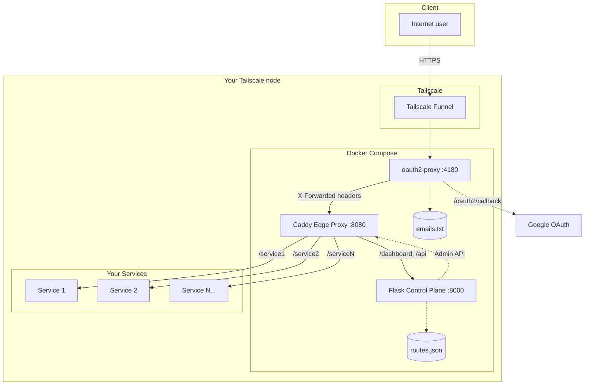
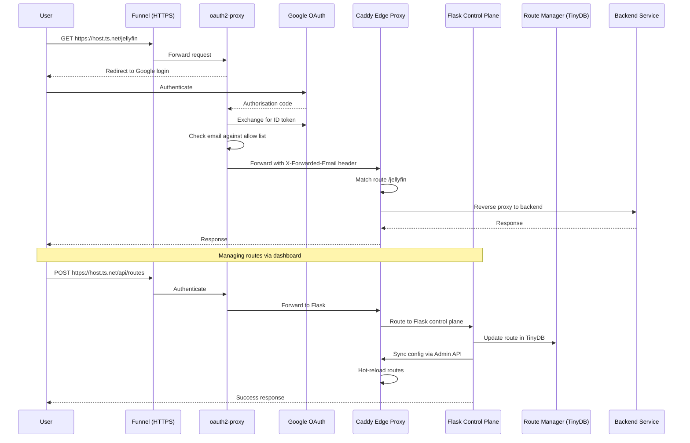

<a id="readme-top"></a>

# Shark-no-Ninsho-Mon

> Protect every self-hosted web app with Google OAuth, smart routing, and delightful tooling.

[](https://www.docker.com/)
[](https://tailscale.com/)
[](https://developers.google.com/identity/protocols/oauth2)
[](https://flask.palletsprojects.com/)


Shark-no-Ninsho-Mon is an opinionated reverse proxy gateway that combines Tailscale Funnel, OAuth2 Proxy, Caddy edge proxy, and a rich Flask dashboard to publish internal services safely. Routes are managed dynamically and hot-reloaded without service interruption. Stay productive whether you deploy from Linux or Windows.

---

## Table of Contents

- [What's inside](#whats-inside)
- [Quick start](#quick-start)
- [Configuration](#configuration)
- [Architecture](#architecture)
- [Caddy edge proxy](#caddy-edge-proxy)
- [Day-2 operations](#day-2-operations)
- [Local development](#local-development)
- [Project structure](#project-structure)
- [Troubleshooting](#troubleshooting)
- [Customization](#customization)
- [Contributing](#contributing)
- [License](#license)
- [Acknowledgments](#acknowledgments)
- [Support](#support)
- [Star history](#star-history)

---

## What's inside

### Security & access control
- Google OAuth2 front door with email allow lists
- Tight integration with Tailscale Funnel (no port-forwarding required)
- Configurable upstream TLS verification for zero-trust backends
- Caddy edge proxy with dynamic routing and hot-reload capabilities

### Route management & health
- Web-based Route Manager with create/update/delete/enable/disable
- Dynamic route synchronization via Caddy Admin API (no container restarts)
- Background connectivity checks with configurable intervals
- REST API for automation (`/api/routes`, `/api/routes/<id>/toggle`, etc.)
- Per-route configuration: protocol (HTTP/HTTPS), host preservation, compression settings

### Developer experience
- Cross-platform setup wizard served locally via Flask
- Centralised configuration loader (`app/config.py`) for predictable overrides
- Development mode toggle that bypasses OAuth while you iterate locally
- Separation of concerns: Flask handles control plane, Caddy handles data plane
- Unit tests that cover TinyDB routing logic, Caddy sync, and proxy behaviour

### Operations-friendly by default
- Structured request logging and `/health` heartbeat endpoint
- Headers/logs viewers for quick debugging of forwarded identity
- Hot-reload of routes without service interruption
- Caddy Admin API accessible on port 2019 for advanced operations
- Works seamlessly on Linux, macOS, and Windows machines

<p align="right">(<a href="#readme-top">back to top</a>)</p>

---

## Quick start

Clone the repository first:

```bash
git clone https://github.com/HaiNick/Shark-no-Ninsho-Mon
cd Shark-no-Ninsho-Mon
```

### Option A — Web-based setup wizard (recommended)

The wizard validates prerequisites, generates secrets, and writes your `.env`.

```bash
python -m venv .venv
source .venv/bin/activate        # PowerShell: .venv\Scripts\Activate.ps1
pip install flask
python setup-wizard.py
```

Open your browser to [http://localhost:8080](http://localhost:8080) (or `http://<your-ip>:8080` from another device on your LAN) and follow the guided checks:

1. Confirm Docker, Docker Compose, and Tailscale are installed and running.
2. Paste Google OAuth2 client credentials and a Tailscale Funnel hostname.
3. **Add your authorized email address** (the Google account that will access the dashboard).
4. Generate secrets and save the resulting `.env` and `emails.txt`.
5. (Optional) Start the Docker stack from the wizard once configuration is complete.

The stack will launch three services:
- **Caddy** (port 8080): Edge proxy handling all data plane traffic
- **OAuth2 Proxy** (port 4180): Google OAuth2 authentication layer
- **Flask** (port 8000): Control plane for route management and dashboard

> **Security Note**: The wizard is accessible on your local network only. It is NOT exposed to the internet unless you explicitly configure port forwarding. No authentication is required, so only run it on trusted networks.

### Option B — Manual configuration & compose

1. Copy the template and edit the resulting file:
   ```bash
   cp .env.template .env
   # Windows PowerShell
   # copy .env.template .env
   ```
2. Fill in the required values (see [Configuration](#configuration)).
3. Allow desired accounts by editing `app/emails.txt` (one email per line).
4. Build and launch the stack:
   ```bash
   docker compose up -d --build
   tailscale funnel --bg 4180
   ```
5. Visit `https://<your-hostname>.ts.net` and sign in with an authorised email.

<p align="right">(<a href="#readme-top">back to top</a>)</p>

---

## Configuration

### Required secrets (`.env`)

```bash
# Google OAuth2
OAUTH2_PROXY_CLIENT_ID=your-client-id
OAUTH2_PROXY_CLIENT_SECRET=your-client-secret

# Session cookie secret (32 random bytes, base64)
OAUTH2_PROXY_COOKIE_SECRET=your-cookie-secret

# Tailscale Funnel
FUNNEL_HOST=https://your-hostname.your-tailnet.ts.net
FUNNEL_HOSTNAME=your-hostname.your-tailnet.ts.net
```

Generate a cookie secret:

```bash
# Linux / macOS
head -c 32 /dev/urandom | base64

# Windows PowerShell
[Convert]::ToBase64String((1..32 | ForEach-Object { Get-Random -Maximum 256 }))
```

The setup wizard performs these steps automatically, but manual deployments can still follow the template above.

### Optional overrides (read by `app/config.py`)

| Variable | Default | Description |
| --- | --- | --- |
| `ROUTES_DB_PATH` | `/app/routes.json` | TinyDB route store location |
| `EMAILS_FILE` | `/app/emails.txt` | Authorised email list |
| `HEALTH_CHECK_ENABLED` | `true` | Toggle background route health worker |
| `HEALTH_CHECK_INTERVAL` | `300` | Seconds between health probes (>= 0) |
| `UPSTREAM_SSL_VERIFY` | `false` | Verify upstream TLS certificates when proxying |
| `DEV_MODE` | `false` | Bypass OAuth and treat every user as authorised |
| `SECRET_KEY` | auto-generated | Flask session key (wizard fills this in) |

> **Windows note:** Replace Unix-style paths with native paths when running natively (e.g. `ROUTES_DB_PATH=C:\\Users\\you\\Shark-no-Ninsho-Mon\\app\\routes.json`).

> **Automatic files:** On first start the app will create `routes.json` (TinyDB store) and `emails.txt` (allow list) if they are missing. If Docker bind mounts temporarily create empty directories, they are replaced with real files; if the directories already contain content, the data files are stored inside them.

<p align="right">(<a href="#readme-top">back to top</a>)</p>

---

## Architecture

### High-level infrastructure



### Request flow



<p align="right">(<a href="#readme-top">back to top</a>)</p>

---

## Caddy edge proxy

Shark-no-Ninsho-Mon uses **Caddy** as a high-performance edge proxy that sits between OAuth2 Proxy and your backend services. This architecture provides:

### Key benefits

- **Hot reload**: Routes are updated dynamically via the Caddy Admin API without container restarts
- **Performance**: Caddy handles all data plane traffic, freeing Flask to focus on the control plane
- **Flexibility**: Per-route configuration for protocol, host headers, compression, and TLS settings
- **Reliability**: Battle-tested reverse proxy with automatic HTTP/2 and connection pooling

### How it works

1. **Control plane (Flask)**: Manages route configuration in TinyDB and exposes the dashboard/API
2. **Data plane (Caddy)**: Handles all incoming traffic and proxies to backends based on route rules
3. **Synchronization**: When you add/update/delete routes via the UI or API, Flask immediately syncs the new configuration to Caddy via its Admin API (port 2019)

### Route configuration

Each route supports:

- `path`: Mount point (e.g., `/jellyfin`)
- `target_ip` and `target_port`: Backend service location
- `protocol`: `http` or `https`
- `preserve_host`: Forward the original `Host` header to the backend
- `no_upstream_compression`: Send `Accept-Encoding: identity` to prevent double compression
- `force_content_encoding`: Override `Content-Encoding` header (`gzip` or `br`) for broken backends
- `sni`: Custom SNI hostname for HTTPS backends
- `insecure_skip_verify`: Skip TLS verification (use with caution)

### Accessing the Admin API

The Caddy Admin API is exposed on port 2019. You can query or modify configuration directly:

```bash
# View current routes
curl http://localhost:2019/config/apps/http/servers/srv0/routes | jq

# View full Caddy config
curl http://localhost:2019/config/ | jq

# Test a config change (use Flask API instead for persistent changes)
curl -X POST http://localhost:2019/load -H "Content-Type: application/json" -d @caddy/base.json
```

<p align="right">(<a href="#readme-top">back to top</a>)</p>

---

## Day-2 operations

### Start or update the stack

```bash
docker compose up -d --build
```

### Verify

```bash
# Show running containers
docker compose ps

# Stream application logs
docker compose logs -f app

docker compose logs -f oauth2-proxy

# Check Tailscale Funnel
tailscale funnel status
```

### Stop safely

```bash
# Disable public access
tailscale funnel off

# Stop containers (retain volumes)
docker compose stop

# Tear everything down
docker compose down
```

<p align="right">(<a href="#readme-top">back to top</a>)</p>

---

## Local development

1. Create a virtual environment and install dependencies:
   ```bash
   python -m venv .venv
   source .venv/bin/activate        # PowerShell: .venv\Scripts\Activate.ps1
   pip install -r app/requirements.txt
   ```
2. Copy `.env.template` to `.env` and set `DEV_MODE=true` (no OAuth required).
3. Run the development server:
   ```bash
   python app/dev.py
   ```
4. Visit [http://localhost:8000](http://localhost:8000). The dev runner auto-adds `dev@localhost` to the allow list and keeps health checks disabled unless you opt in.

<p align="right">(<a href="#readme-top">back to top</a>)</p>

---

## Project structure

```
Shark-no-Ninsho-Mon/
├── docker-compose.yml
├── setup-wizard.py              # Cross-platform configuration wizard
├── setup_templates/             # Wizard UI assets
├── generate-secrets.py          # Stand-alone secret generator
├── app/
│   ├── app.py                   # Flask control plane + REST API
│   ├── config.py                # Centralised settings loader
│   ├── caddy_manager.py         # Caddy Admin API client
│   ├── routes_db.py             # TinyDB route manager
│   ├── dev.py                   # Local development entry point
│   ├── requirements.txt         # Python dependencies
│   ├── test_app.py              # Flask app tests
│   ├── test_caddy_manager.py    # Caddy manager tests
│   ├── test_routes_db.py        # Route database tests
│   ├── templates/               # Jinja templates for UI
│   └── static/                  # CSS/JS assets
├── caddy/
│   ├── Caddyfile                # Base Caddy configuration
│   └── base.json                # Caddy JSON config template
├── README.md
├── CHANGELOG.md
├── SECURITY.md
└── LICENSE
```

<p align="right">(<a href="#readme-top">back to top</a>)</p>

---

## Troubleshooting

### Docker created routes.json or emails.txt as directories

If Docker Compose starts before these files exist, it may create them as directories instead of files. This is a common Docker volume mount behavior.

**Fix it automatically:**
```bash
python fix-files.py
```

**Or fix manually:**
```bash
# Remove the directories (Windows PowerShell)
Remove-Item -Recurse -Force routes.json
Remove-Item -Recurse -Force emails.txt

# Remove the directories (Linux/Mac)
rm -rf routes.json emails.txt

# Run setup wizard or create files manually
python setup-wizard.py
# OR
echo '{"_default": {}}' > routes.json
echo '# Add authorized emails here' > emails.txt
```

Then restart Docker:
```bash
docker compose down
docker compose up -d --build
```

### Docker or Compose issues

```bash
# Permission problems
sudo docker compose up -d --build

# Tail container logs
docker compose logs -f app
docker compose logs -f oauth2-proxy
docker compose logs -f caddy

# Check if all services are running
docker compose ps

# Restart a specific service
docker compose restart caddy
```

### Tailscale Funnel issues

```bash
# Ensure the daemon is connected
tailscale status

# Restart the funnel
tailscale funnel off
tailscale funnel --bg 4180

# Grant operator privileges (Linux)
sudo tailscale set --operator=$USER
```

### Authentication issues

```bash
# Double-check OAuth values
grep OAUTH2 .env

# Inspect authorised emails
cat app/emails.txt

# Confirm redirect URL
python - <<'PY'
from dotenv import dotenv_values
env = dotenv_values('.env')
print(f"https://{env.get('FUNNEL_HOSTNAME','<missing>')}/oauth2/callback")
PY
```

### Route or proxy debugging

```bash
# Check route definitions in TinyDB
python - <<'PY'
from app.routes_db import RouteManager
rm = RouteManager('app/routes.json')
print(rm.get_all_routes())
PY

# Exercise the REST API
curl -H "X-Forwarded-Email: dev@localhost" http://localhost:8000/api/routes

# Check Caddy's active configuration
curl http://localhost:2019/config/apps/http/servers/srv0/routes | jq

# View Caddy logs
docker compose logs -f caddy

# Test a specific backend connection
curl -H "X-Forwarded-Email: dev@localhost" \
     -X POST http://localhost:8000/api/routes/test \
     -H "Content-Type: application/json" \
     -d '{"target_ip":"192.168.1.100","target_port":8080,"protocol":"http"}'
```

### Caddy Admin API issues

```bash
# Verify Caddy Admin API is accessible
curl http://localhost:2019/config/ | jq .

# If routes aren't syncing, check Flask logs for CADDY_SYNC errors
docker compose logs app | grep CADDY_SYNC

# Manually trigger a route sync (requires Python environment)
python - <<'PY'
from app.routes_db import RouteManager
from app.caddy_manager import CaddyManager
rm = RouteManager('app/routes.json')
cm = CaddyManager(admin_url='http://localhost:2019')
cm.sync(rm.get_all_routes())
PY
```

### Need a fresh configuration?

Re-run the setup wizard:

```bash
python setup-wizard.py
```

<p align="right">(<a href="#readme-top">back to top</a>)</p>

---

## Customization

- **Add backend services:** Use the web UI or REST API to add routes pointing to any HTTP/HTTPS service on your network. Changes take effect immediately without container restarts.
- **Customize Caddy:** Modify `caddy/Caddyfile` for base configuration or use the Admin API for advanced scenarios like custom middleware or logging.
- **Integrate with other identity providers:** OAuth2 Proxy supports many providers (GitHub, GitLab, Azure AD, etc.)—adjust the environment variables and compose file accordingly.
- **Harden security:** Enforce IP restrictions, tweak cookie policies, enable TLS verification upstream, or configure SNI for backends using the per-route settings.
- **Automate routes:** Use the REST API (`/api/routes`) to seed, update, or manage routes from CI/CD pipelines or infrastructure-as-code tools.
- **Extend the control plane:** Add custom endpoints to `app/app.py` for integration with monitoring, alerting, or other operational tools.

<p align="right">(<a href="#readme-top">back to top</a>)</p>

---

## Contributing

1. Fork the repository and create a branch: `git checkout -b feature/my-feature`
2. Make your changes and include tests where practical
3. Run the Flask tests or your Linux-based validation pipeline
4. Open a pull request describing the motivation and testing performed

<p align="right">(<a href="#readme-top">back to top</a>)</p>

---

## License

This project is distributed under the [MIT License](LICENSE).

---

## Acknowledgments

- [Tailscale](https://tailscale.com/) for effortless secure networking
- [OAuth2 Proxy](https://oauth2-proxy.github.io/oauth2-proxy/) for rock-solid auth
- [Caddy](https://caddyserver.com/) for the powerful and elegant edge proxy with Admin API
- [Dracula Theme](https://draculatheme.com/) inspiration for the setup wizard facelift
- [Material Symbols](https://fonts.google.com/icons) by Google, used under the Apache License 2.0

<p align="right">(<a href="#readme-top">back to top</a>)</p>

---

## Support

- **Issues & bugs:** [github.com/HaiNick/Shark-no-Ninsho-Mon/issues](https://github.com/HaiNick/Shark-no-Ninsho-Mon/issues)
- **Ideas & feedback:** [github.com/HaiNick/Shark-no-Ninsho-Mon/discussions](https://github.com/HaiNick/Shark-no-Ninsho-Mon/discussions)
- **Questions:** Start a discussion or re-run the setup wizard to gather diagnostics

Before opening an issue, capture:

1. OS and version (Windows, Ubuntu, etc.)
2. Output from `tailscale status`, `docker compose ps`, and key container logs
3. Any modifications to `.env`, Docker Compose, or Route Manager data

<p align="right">(<a href="#readme-top">back to top</a>)</p>

---

## Star history

<div align="center">

[](https://star-history.com/#HaiNick/Shark-no-Ninsho-Mon&Date)

</div>

<p align="right">(<a href="#readme-top">back to top</a>)</p>

---

<div align="center">

**Made with <3 for secure self-hosting**

[](https://github.com/HaiNick/Shark-no-Ninsho-Mon)
•
[](https://github.com/HaiNick/Shark-no-Ninsho-Mon/issues)
•
[](https://github.com/HaiNick/Shark-no-Ninsho-Mon/issues)

If this project helps you, a star goes a long way!

</div>

<p align="right">(<a href="#readme-top">back to top</a>)</p>
