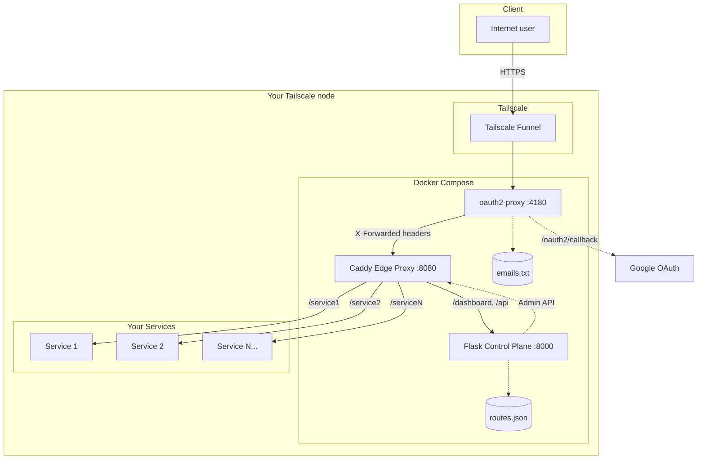
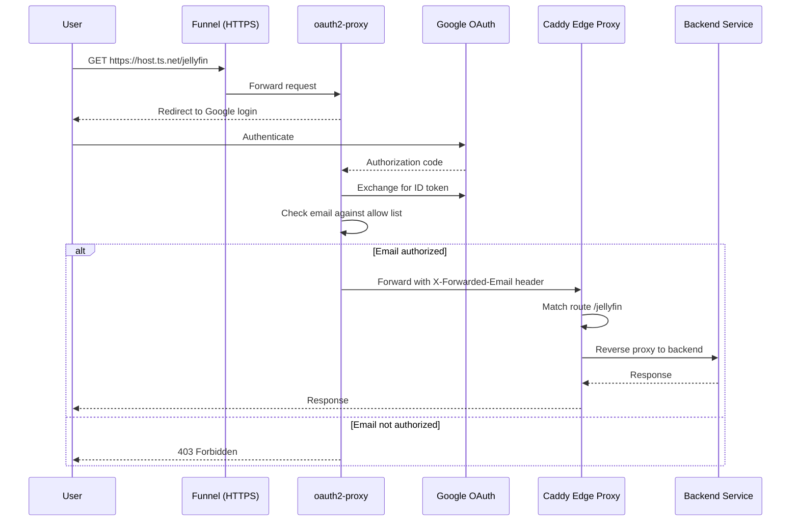
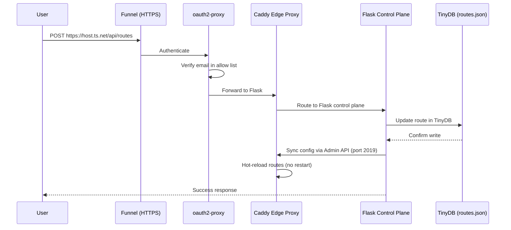
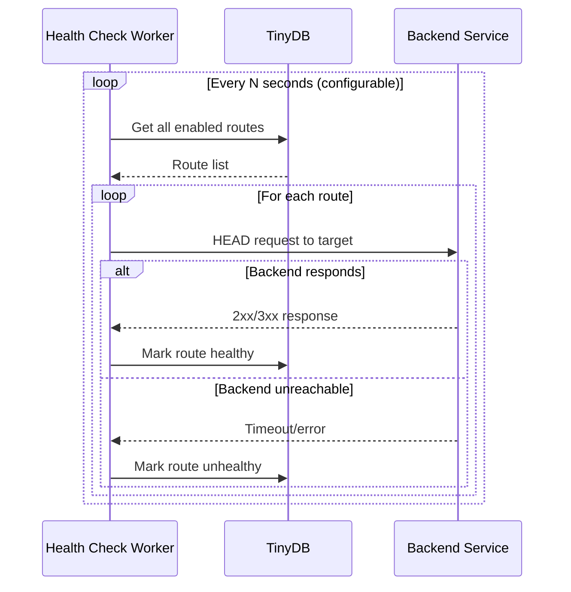

<a id="architecture-top"></a>

# Architecture

> Deep dive into the architectural design, request flow, and component interactions.

[](../README.md)

---

## Table of Contents

- [Overview](#overview)
- [High-level infrastructure](#high-level-infrastructure)
- [Component responsibilities](#component-responsibilities)
- [Request flow](#request-flow)
- [Data persistence](#data-persistence)
- [Security model](#security-model)

---

## Overview

Shark-no-Ninsho-Mon implements a **control plane / data plane separation** architecture:

- **Control Plane (Flask)**: Manages route configuration, provides the web dashboard, and exposes a REST API
- **Data Plane (Caddy)**: Handles all incoming traffic and reverse proxies to backends based on route rules
- **Authentication Layer (OAuth2 Proxy)**: Verifies user identity before allowing access to any service
- **Network Layer (Tailscale Funnel)**: Provides secure public HTTPS access without port forwarding

<p align="right">(<a href="#architecture-top">back to top</a>)</p>

---

## High-level infrastructure



<p align="right">(<a href="#architecture-top">back to top</a>)</p>

---

## Component responsibilities

### 1. Tailscale Funnel
- **Port**: Public HTTPS endpoint
- **Responsibilities**:
  - Terminate TLS with valid certificate
  - Forward traffic to OAuth2 Proxy on port 4180
  - No port forwarding or firewall configuration required

### 2. OAuth2 Proxy
- **Port**: 4180 (internal)
- **Responsibilities**:
  - Authenticate users via Google OAuth2
  - Validate user email against `emails.txt` allow list
  - Inject identity headers (`X-Forwarded-Email`, `X-Forwarded-User`)
  - Manage session cookies with configurable refresh intervals
  - Automatically refresh authentication tokens (configurable: minutely, hourly, daily, weekly, monthly)
  - Forward authenticated requests to Caddy

### 3. Caddy Edge Proxy
- **Port**: 8080 (internal), 2019 (Admin API)
- **Responsibilities**:
  - Route traffic based on path prefixes
  - Reverse proxy to Flask control plane (`/dashboard`, `/api/*`)
  - Reverse proxy to backend services (all other paths)
  - Hot-reload configuration via Admin API
  - Handle connection pooling, HTTP/2, compression

### 4. Flask Control Plane
- **Port**: 8000 (internal)
- **Responsibilities**:
  - Serve web dashboard for route management
  - Expose REST API for route CRUD operations
  - Persist routes to TinyDB (`routes.json`)
  - Synchronize routes to Caddy via Admin API
  - Run background health checks (optional)
  - Provide `/health` endpoint for monitoring
  - Manage dashboard sessions with configurable cookie lifetime
  - Session security: httpOnly, secure, SameSite protection

### 5. TinyDB Storage
- **File**: `routes.json`
- **Responsibilities**:
  - Persist route configuration (path, target, protocol, options)
  - Track route status (enabled/disabled)
  - Store health check results

### 6. Email Allow List
- **File**: `emails.txt`
- **Responsibilities**:
  - Define authorized user emails (one per line)
  - Consumed by OAuth2 Proxy for access control

<p align="right">(<a href="#architecture-top">back to top</a>)</p>

---

## Request flow

### Authentication flow



### Route management flow



### Health check flow



<p align="right">(<a href="#architecture-top">back to top</a>)</p>

---

## Data persistence

### Routes database (`routes.json`)

**Format**: TinyDB JSON file (NoSQL document store)

**Schema**:
```json
{
  "_default": {
    "1": {
      "path": "/jellyfin",
      "target_ip": "192.168.1.100",
      "target_port": 8096,
      "protocol": "http",
      "enabled": true,
      "preserve_host": false,
      "no_upstream_compression": false,
      "force_content_encoding": null,
      "sni": null,
      "insecure_skip_verify": false,
      "last_checked": "2025-10-17T10:30:00",
      "status": "healthy"
    }
  }
}
```

**Persistence**:
- File-based storage with atomic writes
- TinyDB provides basic file locking (not suitable for high concurrency)
- Mounted as Docker volume for durability
- Backup recommended (include in nightly snapshots)

### Email allow list (`emails.txt`)

**Format**: Plain text, one email per line

**Example**:
```
user@example.com
admin@company.org
# Comments allowed
```

**Persistence**:
- Read by OAuth2 Proxy on each authentication check
- Mounted as Docker volume
- Changes take effect immediately (no restart required)

<p align="right">(<a href="#architecture-top">back to top</a>)</p>

---

## Security model

### Defense in depth

1. **Public Access**: Tailscale Funnel with valid TLS certificate
2. **Authentication**: Google OAuth2 with email allow list
3. **OAuth Session Management**: Secure, httpOnly, sameSite cookies with configurable refresh intervals
4. **Dashboard Session Management**: Flask sessions with separate configurable lifetime and security settings
5. **Authorization**: Per-request email verification
6. **Backend Isolation**: Services only accessible via authenticated proxy
7. **Admin API Security**: Caddy Admin API bound to localhost only (127.0.0.1:2019)

### Cookie management overview

Shark-no-Ninsho-Mon uses **two separate cookie systems** for enhanced security:

#### 1. OAuth2 Proxy Cookies (Authentication)
- **Purpose**: Prove user identity via Google OAuth2
- **Configuration**: `OAUTH2_PROXY_COOKIE_*` variables
- **Refresh**: Configurable automatic refresh (minutely/hourly/daily/weekly/monthly)
- **Expiration**: `OAUTH2_PROXY_COOKIE_EXPIRE` (default: 7 days)
- **Security**: Secure, httpOnly, SameSite=lax

#### 2. Flask Session Cookies (Dashboard State)
- **Purpose**: Maintain dashboard session state
- **Configuration**: `SESSION_COOKIE_*` and `PERMANENT_SESSION_LIFETIME` variables
- **Lifetime**: Configurable (default: 7 days / 604800 seconds)
- **Security**: Secure, httpOnly, SameSite=Lax
- **Scope**: Only affects Flask dashboard, not OAuth authentication

**Why two systems?**
- Separation of concerns: Authentication (OAuth2) vs. Application State (Flask)
- Flexibility: Different expiration policies for auth vs. dashboard usage
- Defense in depth: If one cookie is compromised, the other provides additional protection

### Cookie refresh security

OAuth2 Proxy can be configured to automatically refresh authentication tokens at regular intervals:

- **Minutely** (`OAUTH2_PROXY_COOKIE_REFRESH=1m`): For testing only
- **Hourly** (`OAUTH2_PROXY_COOKIE_REFRESH=1h`): High-security environments
- **Daily** (`OAUTH2_PROXY_COOKIE_REFRESH=24h`): Balanced security and user experience
- **Weekly** (`OAUTH2_PROXY_COOKIE_REFRESH=168h`): Standard security (recommended)
- **Monthly** (`OAUTH2_PROXY_COOKIE_REFRESH=720h`): Lower security, better convenience

When refresh is triggered, users are seamlessly re-authenticated with their OAuth provider without losing their session, ensuring credentials are regularly validated.

### Trust boundaries

```
Internet → Tailscale (TLS) → OAuth2 Proxy (Auth) → Caddy (Routing) → Backends
                                                  ↓
                                            Flask (Control)
```

- **Public-facing**: Only Tailscale Funnel endpoint
- **Authenticated zone**: Everything behind OAuth2 Proxy
- **Internal zone**: Caddy Admin API, backend services
- **Control plane**: Flask manages configuration but doesn't handle user traffic

### Critical security notes

⚠️ **Never expose Caddy Admin API (port 2019) publicly** — it allows full configuration control without authentication.

⚠️ **Disable DEV_MODE in production** — it bypasses all authentication checks.

⚠️ **Rotate OAuth2 secrets regularly** — cookie secret and client credentials should be treated as highly sensitive.

⚠️ **Verify upstream TLS when possible** — set `UPSTREAM_SSL_VERIFY=true` for production backends with valid certificates.

<p align="right">(<a href="#architecture-top">back to top</a>)</p>

---

<div align="center">

[](../README.md)

**Made with <3 for secure self-hosting**

</div>

<p align="right">(<a href="#architecture-top">back to top</a>)</p>
