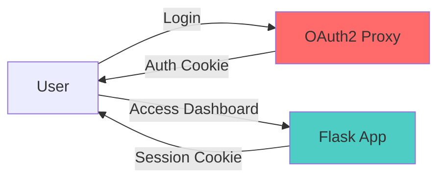

<a id="cookie-top"></a>

# Cookie Management

> Understanding and configuring the dual-cookie security system in Shark-no-Ninsho-Mon.

[](../README.md)

---

## Table of Contents

- [Overview](#overview)
- [OAuth2 Proxy Cookies](#oauth2-proxy-cookies)
- [Flask Session Cookies](#flask-session-cookies)
- [Configuration Examples](#configuration-examples)
- [Security Best Practices](#security-best-practices)
- [Troubleshooting](#troubleshooting)

---

## Overview

Shark-no-Ninsho-Mon uses a **dual-cookie system** for enhanced security and flexibility:

1. **OAuth2 Proxy Cookies** - Handle user authentication via Google OAuth2
2. **Flask Session Cookies** - Manage dashboard application state

This separation provides defense in depth and allows independent configuration of authentication and application session policies.



<p align="right">(<a href="#cookie-top">back to top</a>)</p>

---

## OAuth2 Proxy Cookies

### Purpose

OAuth2 Proxy cookies prove user identity. They contain:
- User's email address
- OAuth2 access token
- Session expiration timestamp

### Configuration Variables

| Variable | Default | Description |
| --- | --- | --- |
| `OAUTH2_PROXY_COOKIE_SECRET` | Required | 32-byte base64 secret for cookie encryption |
| `OAUTH2_PROXY_COOKIE_EXPIRE` | `168h` | How long before re-authentication required (7 days) |
| `OAUTH2_PROXY_COOKIE_REFRESH` | `0` | How often to refresh token (0 = disabled) |
| `OAUTH2_PROXY_COOKIE_SECURE` | `true` | Only send over HTTPS |
| `OAUTH2_PROXY_COOKIE_SAMESITE` | `lax` | CSRF protection level |

### Refresh Behavior

When `OAUTH2_PROXY_COOKIE_REFRESH` is non-zero:

1. User authenticates with Google
2. OAuth2 Proxy issues encrypted session cookie
3. At refresh interval, OAuth2 Proxy checks token validity with Google
4. If valid, new cookie is issued (seamless to user)
5. If invalid, user is redirected to login

**Refresh Intervals**:
```bash
# Testing only
OAUTH2_PROXY_COOKIE_REFRESH=1m

# High security (every hour)
OAUTH2_PROXY_COOKIE_REFRESH=1h

# Balanced (daily)
OAUTH2_PROXY_COOKIE_REFRESH=24h

# Recommended (weekly)
OAUTH2_PROXY_COOKIE_REFRESH=168h

# Lower security (monthly)
OAUTH2_PROXY_COOKIE_REFRESH=720h

# Disabled (default)
OAUTH2_PROXY_COOKIE_REFRESH=0
```

### When to Use Refresh

**Enable refresh (`1h` to `168h`) when**:
- Enforcing strict security policies
- Need to detect revoked Google accounts quickly
- Compliance requires regular credential validation
- Users have elevated privileges

**Disable refresh (`0`) when**:
- Personal home lab with trusted users
- Minimizing external dependencies
- Optimizing for offline resilience
- OAuth provider rate limits are a concern

<p align="right">(<a href="#cookie-top">back to top</a>)</p>

---

## Flask Session Cookies

### Purpose

Flask session cookies maintain dashboard state. They contain:
- Session ID
- CSRF tokens
- UI preferences (future)

### Configuration Variables

| Variable | Default | Description |
| --- | --- | --- |
| `SECRET_KEY` | Required | Flask secret key for session signing |
| `PERMANENT_SESSION_LIFETIME` | `604800` | Session lifetime in seconds (7 days) |
| `SESSION_COOKIE_SECURE` | `true` | Only send over HTTPS |
| `SESSION_COOKIE_HTTPONLY` | `true` | Block JavaScript access |
| `SESSION_COOKIE_SAMESITE` | `Lax` | CSRF protection level |

### Lifetime Examples

```bash
# 1 hour (very restrictive)
PERMANENT_SESSION_LIFETIME=3600

# 1 day
PERMANENT_SESSION_LIFETIME=86400

# 7 days (recommended)
PERMANENT_SESSION_LIFETIME=604800

# 30 days
PERMANENT_SESSION_LIFETIME=2592000
```

### Session Behavior

Flask sessions are **stateless** - all data is stored client-side in the signed cookie:

1. User accesses dashboard
2. Flask creates signed session cookie
3. Cookie is sent with every dashboard request
4. Flask verifies signature using `SECRET_KEY`
5. After `PERMANENT_SESSION_LIFETIME` expires, user must re-authenticate with OAuth2

**Important**: Flask sessions are tied to OAuth2 authentication. If the OAuth2 cookie expires or becomes invalid, the Flask session is effectively useless.

<p align="right">(<a href="#cookie-top">back to top</a>)</p>

---

## Configuration Examples

### Scenario 1: High Security (Enterprise)

```bash
# OAuth2: Short-lived with hourly refresh
OAUTH2_PROXY_COOKIE_EXPIRE=24h
OAUTH2_PROXY_COOKIE_REFRESH=1h
OAUTH2_PROXY_COOKIE_SECURE=true
OAUTH2_PROXY_COOKIE_SAMESITE=strict

# Flask: Short session lifetime
PERMANENT_SESSION_LIFETIME=3600  # 1 hour
SESSION_COOKIE_SECURE=true
SESSION_COOKIE_HTTPONLY=true
SESSION_COOKIE_SAMESITE=Strict
```

**Effect**: Users authenticate daily, credentials validated hourly, dashboard sessions last 1 hour.

### Scenario 2: Balanced (Recommended)

```bash
# OAuth2: Week-long auth with weekly refresh
OAUTH2_PROXY_COOKIE_EXPIRE=168h
OAUTH2_PROXY_COOKIE_REFRESH=168h
OAUTH2_PROXY_COOKIE_SECURE=true
OAUTH2_PROXY_COOKIE_SAMESITE=lax

# Flask: Week-long sessions
PERMANENT_SESSION_LIFETIME=604800  # 7 days
SESSION_COOKIE_SECURE=true
SESSION_COOKIE_HTTPONLY=true
SESSION_COOKIE_SAMESITE=Lax
```

**Effect**: Users authenticate weekly, credentials validated weekly, good balance of security and UX.

### Scenario 3: Convenience (Home Lab)

```bash
# OAuth2: Month-long auth, no refresh
OAUTH2_PROXY_COOKIE_EXPIRE=720h
OAUTH2_PROXY_COOKIE_REFRESH=0
OAUTH2_PROXY_COOKIE_SECURE=true
OAUTH2_PROXY_COOKIE_SAMESITE=lax

# Flask: Month-long sessions
PERMANENT_SESSION_LIFETIME=2592000  # 30 days
SESSION_COOKIE_SECURE=true
SESSION_COOKIE_HTTPONLY=true
SESSION_COOKIE_SAMESITE=Lax
```

**Effect**: Users authenticate monthly, minimal interruptions, suitable for trusted environments.

### Scenario 4: Development

```bash
# Development mode bypasses OAuth entirely
DEV_MODE=true

# Flask: Short sessions for testing
PERMANENT_SESSION_LIFETIME=3600  # 1 hour
SESSION_COOKIE_SECURE=false  # Allow HTTP
SESSION_COOKIE_HTTPONLY=true
SESSION_COOKIE_SAMESITE=Lax
```

**Effect**: No OAuth required, Flask sessions active for 1 hour, HTTP allowed for local dev.

<p align="right">(<a href="#cookie-top">back to top</a>)</p>

---

## Security Best Practices

### Production Checklist

- [ ] Set `OAUTH2_PROXY_COOKIE_SECURE=true` (require HTTPS)
- [ ] Set `SESSION_COOKIE_SECURE=true` (require HTTPS)
- [ ] Set `SESSION_COOKIE_HTTPONLY=true` (prevent XSS)
- [ ] Use `lax` or `strict` for SameSite (CSRF protection)
- [ ] Generate strong `OAUTH2_PROXY_COOKIE_SECRET` (32 bytes)
- [ ] Generate strong `SECRET_KEY` (64 hex characters minimum)
- [ ] Never commit `.env` to version control
- [ ] Rotate secrets regularly (quarterly recommended)
- [ ] Configure appropriate expiration times for your threat model
- [ ] Enable OAuth2 cookie refresh for high-security environments

### Cookie Rotation

Rotate cookie secrets when:
- Suspected compromise
- Employee termination
- Regular maintenance (quarterly)
- Major security policy changes

**Rotation procedure**:

```powershell
# Generate new secrets
python generate-secrets.py

# Update .env with new values
# OAUTH2_PROXY_COOKIE_SECRET=<new-value>
# SECRET_KEY=<new-value>

# Restart services
docker compose down
docker compose up -d
```

**Impact**: All users must re-authenticate. Schedule during maintenance window.

### Secure Cookie Attributes

| Attribute | OAuth2 | Flask | Purpose |
| --- | --- | --- | --- |
| `Secure` | Yes | Yes | Only transmit over HTTPS |
| `HttpOnly` | Yes | Yes | Block JavaScript access (XSS protection) |
| `SameSite` | Lax | Lax | CSRF protection |
| `Path` | `/` | `/` | Cookie scope |
| `Domain` | Auto | Auto | Cookie domain |

<p align="right">(<a href="#cookie-top">back to top</a>)</p>

---

## Troubleshooting

### Users immediately logged out

**Symptom**: User authenticates but is immediately logged out

**Possible causes**:
1. `OAUTH2_PROXY_COOKIE_SECURE=true` but accessing over HTTP
   - Solution: Access via HTTPS or set to `false` for development
2. Clock skew between server and client
   - Solution: Sync system time with NTP
3. Cookie domain mismatch
   - Solution: Verify `FUNNEL_HOSTNAME` matches access URL

### Session expires too quickly

**Symptom**: User must re-authenticate more often than expected

**Check**:
1. `OAUTH2_PROXY_COOKIE_EXPIRE` - OAuth2 session lifetime
2. `OAUTH2_PROXY_COOKIE_REFRESH` - May trigger re-auth if token invalid
3. `PERMANENT_SESSION_LIFETIME` - Flask session lifetime

**Solution**: Increase lifetime values in `.env`

### Cookie not persisting

**Symptom**: Cookie disappears after browser close

**Cause**: Cookies are session cookies (no expiration set)

**Check**: Ensure `PERMANENT_SESSION_LIFETIME` is set in `.env`

### Refresh causing frequent re-authentication

**Symptom**: Users complain about frequent login prompts

**Check**: `OAUTH2_PROXY_COOKIE_REFRESH` is set too aggressively

**Solutions**:
- Increase refresh interval (e.g., from `1h` to `24h` or `168h`)
- Disable refresh entirely (`OAUTH2_PROXY_COOKIE_REFRESH=0`)
- Verify Google OAuth token is valid (check OAuth2 Proxy logs)

### Different cookies on different devices

**Symptom**: User authenticated on desktop but not mobile

**Cause**: Cookies are device-specific (by design)

**Explanation**: Each device gets its own authentication cookie. This is normal and expected behavior for security.

### Inspecting cookies (for debugging)

**Chrome/Edge**:
1. Open Developer Tools (F12)
2. Go to Application → Cookies
3. Look for cookies on your domain

**PowerShell** (view cookie details):
```powershell
# This won't show cookie values (encrypted), but can verify presence
# Use browser dev tools instead
```

<p align="right">(<a href="#cookie-top">back to top</a>)</p>

---

<div align="center">

[](../README.md)

**Made with <3 for secure self-hosting**

</div>

<p align="right">(<a href="#cookie-top">back to top</a>)</p>
